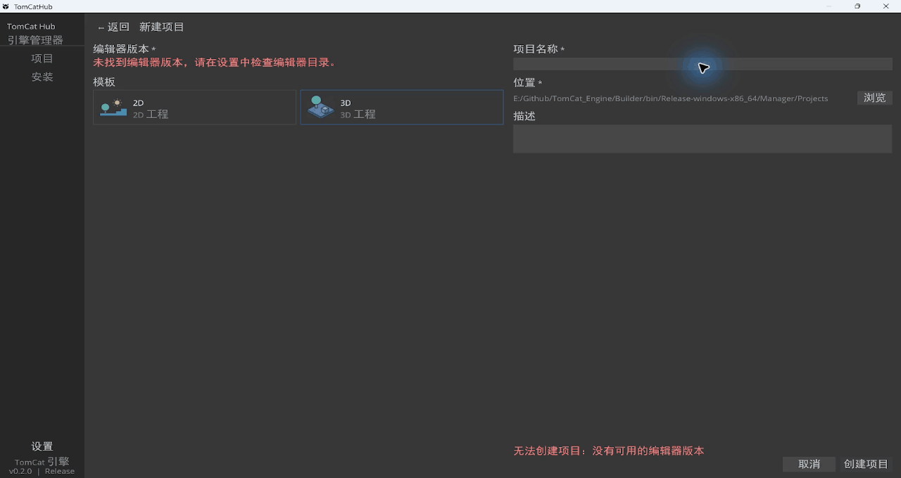
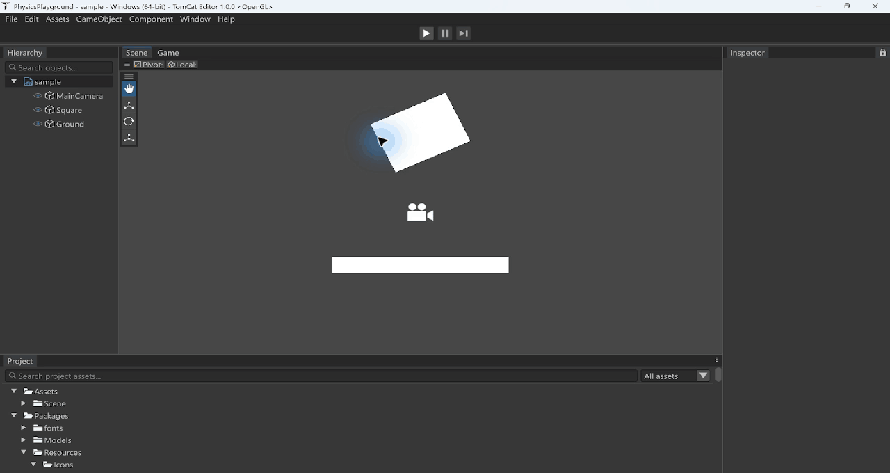
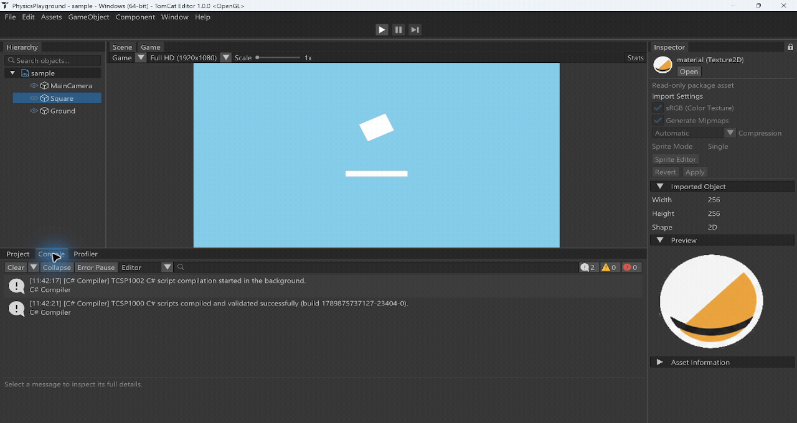
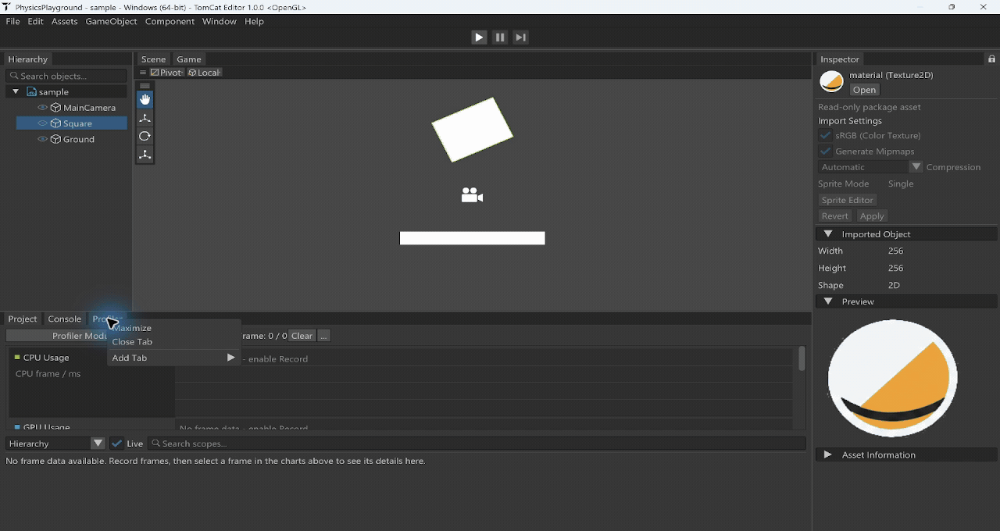
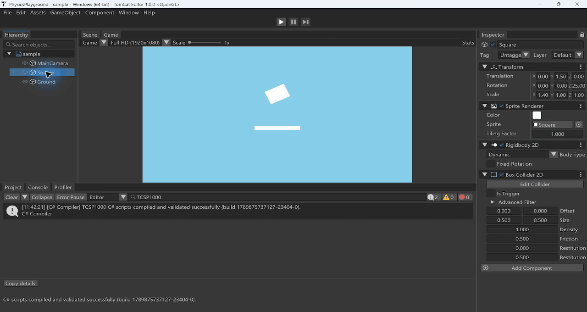

# TomCat Engine

A **C++20 game engine for 2D development**, with a visual editor, a project hub,
and a standalone game runtime.

TomCat brings scene composition, asset management, C# gameplay scripting, and
Box2D physics into one development environment. Its engine library provides the
rendering, ekit ECS scene model, and runtime systems; the Editor exposes those systems
through visual authoring tools, while the Player runs packaged games independently.

**C++20 · OpenGL · ImGui · ekit · Box2D · .NET 10 · Windows x64 · MIT**

**Languages**: English | [简体中文](README.zh-CN.md)

Documentation reviewed against the repository on **2026-09-20**. Product version: **0.3.0**.
See the [documentation index](docs/README.md) for all guides and Chinese editions.

---

## Project Overview

| Component | Role |
| --- | --- |
| **Engine** | C++ library for rendering, ECS scenes, assets, physics, input, audio, and UI |
| **Editor** | Visual scene composition, component editing, resource browsing, and Play Mode |
| **Hub** | Project templates, project discovery, and Editor version selection |
| **Managed** | C# gameplay API, script compilation, and runtime hosting |
| **Player** | Independent game executable with packaged assets and a private .NET runtime |
| **Web (experimental)** | Emscripten/WebGL2 Player and shared native ImGui editor panels, with a browser host responsible for persistence |

## ECS backend: ekit

TomCat now uses [ekit](https://github.com/chnnasn/ekit) in place of EnTT. Scene
components use explicitly registered sparse storage, including components that
own strings, containers, and resource references. Entity handles retain their
64-bit index/generation; editor picking uses separate integer IDs to prevent
stale selections from resolving to recycled entities. Scene UUIDs and existing
scene/prefab serialization formats are unchanged.

The vendored dependency is pinned to `82d4de67f37d5d146bb7287e07116dc7567af996`.
The integration fixes were submitted upstream as [ekit PR #2](https://github.com/chnnasn/ekit/pull/2):
owning sparse components, stable references during storage growth, conflicting
storage registration checks, and multi-translation-unit header linkage.
See the [migration and plugin registration guide](docs/EKIT_MIGRATION.md) and
[dependency provenance](TomCat/vendor/ekit/README.tomcat.md).

Validation on Windows x64 (MSVC Release): all ten native regression executables,
Editor/Player/Hub/CLI builds, CLI smoke, and release script tests passed. The ekit
suite passed 4,417 checks. Web code and include paths are migrated, but the
WebAssembly build was not verified because Emscripten was unavailable.

## Showcase

Recorded on **2026-09-20** with the Windows Release Hub and Editor at source
commit `8393eeb`. These are actual application recordings; the
[capture notes, hashes and cuts](docs/portfolio/README.md) distinguish this
session from the archived 2026-09-15 authoring demonstration.

### Hub and scene templates

The Hub keeps its own layout, with the cat-cube application icon and distinct
2D/3D scene template artwork. This session demonstrates template selection.
No Editor installation was recognized in the recording environment, so it does
not demonstrate successful project creation or launching from the Hub.



### Project assets and Inspector

Selecting a Project resource opens its type-specific information in the main
Inspector. The recording shows entity properties, a Scene asset, then a package
image's import settings and preview. Images have real thumbnails even in the
single-column list; package resources are read-only. The Inspector lock sits at
the far right of the tab row, and the original Packages icon set remains in use.



### Console search and details

Console combines severity counts, duplicate collapsing and text search with
two-line message rows and a separate details area. Here, searching `TCSP1000`
filters the actual script compilation messages to the success diagnostic.



### Visual profiling

The dockable Profiler offers CPU Usage, GPU Usage, Rendering and Memory modules,
frame selection, and Hierarchy/Timeline details. This recording captures Edit-mode
samples, stops recording, selects a frame and opens the module selector. OBS was
running throughout; the displayed timings are not performance benchmarks.



### Live simulation

Play runs a copy of the authored scene with fixed-step Box2D physics. The sample
rectangle falls onto the floor; Pause and Step inspect runtime state, and Stop
restores its initial position and rotation. Physics footage stays at real-time speed.



Open [PhysicsPlayground](Samples/PhysicsPlayground/README.md) to reproduce it.
Still images: [Hub](docs/portfolio/2026-09-20/hub-templates.png),
[asset Inspector](docs/portfolio/2026-09-20/editor-assets.png),
[Profiler Timeline](docs/portfolio/2026-09-20/profiler-timeline.png).

## Features

- **2D rendering**: OpenGL batched sprites, lines, circles, cameras, framebuffer-based Scene/Game views, entity picking, stable Sprite Atlas subassets with Rect/Pivot/PPU/Border semantics, deterministic sprite sorting, animation clips, and a parameter-driven Animator state machine
- **Scene system**: ECS entities, hierarchy, stable UUIDs, strict YAML serialization, ordered Build Settings, asynchronous reads with activation control, additive ownership in a shared runtime world, persistent roots, and explicit unloading
- **Asset identity workflow**: stable `AssetHandle` references, `.tcmeta` schema-v2 sidecars, ImporterRegistry, SHA-256 artifact keys, a derived-data cache, dependency tracking, and a background ImportCoordinator with debounced content monitoring, reverse-dependent reimport, and main-thread publication
- **2D physics**: fixed 60 Hz Box2D runtime, explicit and implicit-static bodies, Box/Circle colliders, triggers, filtering, ray/AABB queries, forces, impulses, and `DistanceJoint2D`
- **Physics authoring**: Scene-view collider overlays, collider handles, project Tags/Layers and a Physics 2D collision matrix, combined Play/Stop plus Pause/Step controls, and deferred C# Collision/Trigger callbacks
- **C# scripting**: .NET 10 project compilation, serialized Inspector fields, collectible Play domains, lifecycle callbacks, Entity/Transform/Input/Physics/Scene APIs, diagnostics, last-good assemblies, and cooked managed payloads
- **Prefabs**: LocalID subtrees and reference remapping, linked editor updates, overrides, Apply/Revert, nested Prefabs and variants; runtime C# `Instantiate` retains snapshot semantics. See the [Prefab workflow](docs/PREFAB_WORKFLOW.zh-CN.md).
- **Input**: action maps, keyboard/mouse/gamepad bindings, contexts, and runtime rebinding
- **Runtime text and UI**: TTF/OTF/TTC fonts, deterministic on-demand glyph atlases, strict UTF-8 with explicit primary/CJK/emoji fallback chains and a final replacement glyph, world text, and Canvas/RectTransform/Image/Text/Button/EventSystem/LayoutGroup components with DPI-aware layout, clipping, raycast targeting, navigation, and per-interaction gameplay-input capture
- **Audio**: in-memory WAV clips, bounded PCM WAV streaming, 2D spatial audio, AudioSource/AudioListener, Null and XAudio2 backends, device-loss fallback, and Master/Music/SFX buses
- **Editor**: dockable Scene/Game/Hierarchy/Inspector/Project/Console/Profiler panels, saved layouts, tab context menus (Maximize / Close Tab / Add Tab), non-collapsible window headers, Hierarchy Scene visibility, resource Inspector with import Apply/Revert, real image thumbnails, original package icons, searchable diagnostics, Undo/Redo, autosave/recovery, project locking, and user settings
- **Standalone Player**: path-free `.tcpak` v7 packages with per-entry SHA-256 and v5/v6/v7 Player compatibility, an independent non-Editor executable, versioned PlayerSettings/BootManifest data, fixed hashed win-x64 Player Templates, and a bundled private .NET runtime
- **Hub**: project creation and discovery, identity-based Editor installation scanning and version selection, exact executable-path launching, and per-user recent-project state
- **Product UI and localization**: sliders, scroll views, single-line Unicode input, inherited themes, and game-language tables with fallback; OS IME commits are supported, with composition limits described in [Runtime UI](docs/RUNTIME_UI_PRODUCT.zh-CN.md)
- **Performance tools**: visual CPU timeline, asynchronous GPU frame timing, draw statistics, process memory and tracked resource estimates; see [profiling and C# debugger setup](docs/DEBUGGING_AND_PROFILING.md)
- **Regression coverage**: one Release entry point for managed ABI/lifecycle, physics, Sprite assets, scripts, safety, Editor recovery, audio, importers, input, SceneManager, Prefab, Cook, and isolated Player startup; a separate WASM editor protocol regression

## Current Scope

- Supported development platform: **Windows x64**
- Rendering backend: **OpenGL 4.6**
- Experimental browser target: **WebGL2 + SharedArrayBuffer/Workers**; see [Web setup and limitations](Web/README.md). C# payloads, audible audio, custom cooked SPIR-V shaders, and multisample framebuffers are unsupported there.
- Primary engine scope: **2D**
- The experimental 3D template configures a perspective camera; a production 3D renderer is not implemented yet
- Editor-side C# compilation requires the **.NET 10 SDK**
- Exported Players carry a fixed private .NET runtime and the required C++ runtime DLLs, without requiring global .NET or Visual Studio
- NuGet/third-party managed DLLs, Play Mode hot reload, and a built-in C# debugger are unsupported. Async scene resource publication/activation remains on the main thread; input fields do not yet provide engine-side IME preedit or candidate-window positioning.

The [recording archive](docs/portfolio/README.md) records the exact scope and
limitations of each desktop session. The 2026-09-20 refresh checked the UI flows
shown above; it did not rerun the complete native, managed, Player or Web regression suites.

## Building

### Dependencies

- Windows x64 with an OpenGL 4.6-capable GPU/driver
- Visual Studio 2022+
- .NET 10 SDK (required to compile project C# scripts in the Editor)
- Python 3 with `pip` (used by the setup helper)
- premake5 (auto-downloaded by the setup script)

> The Vulkan SDK is provided automatically via a git submodule (`vendor/VulkanSDK`, based on VulkanSDK-Windows) - no manual install or environment variables needed.

### Steps

1. Clone the repo with submodules: `git clone --recurse-submodules ...`
2. Run `Scripts\Setup.bat` once to prepare Premake and the setup dependencies
3. Run `Scripts\Win_GenProjects.bat` to generate the VS projects
4. Open `Editor\Editor.sln`, `Builder\Builder.sln`, `Player\Player.sln`, or `Tests\Tests.sln` and build the required target (Release x64)

The CLI solution is generated separately; follow [TomCatCLI](Tools/TomCatCLI/README.md).
Web uses its own [CMake/Emscripten build](Web/README.md).

Source-build executable locations (Release x64):

| Application | Path from the repository root |
| --- | --- |
| Editor | `Editor/bin/Release-windows-x86_64/TomCatInut/TomCatInut.exe` |
| Hub | `Builder/bin/Release-windows-x86_64/Manager/Manager.exe` |
| Headless CLI | `Tools/bin/Release-windows-x86_64/TomCatCLI/TomCatCLI.exe` |

The packaged Editor is named `TomCat.exe`; rebuilding the source executable does
not update an already packaged or separately installed copy. Point Hub Settings
at the intended Editor installation before creating or launching a project.

After `Scripts\Setup.bat` has prepared Premake, run the complete Release suite with `powershell -ExecutionPolicy Bypass -File Scripts\Run-Regressions.ps1`.

## Directory Layout

```
TomCat/            Engine core (rendering, ECS, physics, ImGui integration)
Editor/TomCatInut/ Editor application
Player/            Independent Windows x64 game runtime
Managed/           .NET 10 runtime API, source generator, host, and regressions
Builder/Manager/   Hub (project center)
Tests/             Engine regression test projects
Scripts/           Build & packaging scripts
Tools/TomCatCLI/    Headless cook and Windows Player build commands
Web/               Experimental browser targets, fonts, and WASM protocol regression
Samples/           Reproducible sample projects
docs/              Documentation index and recorded demonstrations
vendor/            premake and third-party dependencies
```

## Editor and Hub Packaging

- Local: `Scripts\Package-Editor.ps1` / `Scripts\Package-Hub.ps1`
- CI: push and pull requests run the unified Release regressions; the packaging workflow can publish Editor / Hub / both
- The official Editor download is one EVB-compressed `TomCat.exe`. Editor resources stay in its virtual `Packages` tree; the embedded manifest, Managed toolchain, headless CLI, and win-x64 Player Template are extracted only when the Editor runtime is needed, then verified and atomically cached below `%LOCALAPPDATA%\TomCat\Editor\Runtime` for reuse.
- Run packaged headless builds through `TomCat.exe --cli cook ...` or `TomCat.exe --cli build ...`. The wrapper verifies the same embedded runtime and forwards the command to its cached `TomCatCLI.exe`.
- User settings, layouts, logs, project source, and authoring JSON remain outside the executable and its immutable runtime cache.
- Editor **Build** / **Build And Run** cooks enabled Build Settings scenes into `Game.tcpak`, copies the strict Player Template through staging, verifies every SHA-256 and compatibility version, then atomically publishes the build.

## Status and Roadmap

### Completed 2D Physics Milestone

- [x] Fixed-step Play / Pause / Step / Stop scene state model with a combined Play/Stop toolbar control (no separate Simulate state)
- [x] Scene-only Box/Circle collider visualization and Edit Collider handles
- [x] CircleCollider2D, implicit static bodies, triggers, per-fixture and project-layer collision filtering, queries, motion API, and DistanceJoint2D
- [x] Deferred engine/native-script Collision and Trigger callbacks
- [x] Project Settings for Tags, 16 stable Layers, and the symmetric Physics 2D collision matrix
- [x] Scene schema v11 writing with v9-v11 reading, registry-backed components, and cooked-package v7 physics round trips
- [x] Physics regression suite (`Scripts\Run-PhysicsRegression.ps1`)

### Completed V1 C#, Player, Scene, and Prefab Milestones

- [x] Managed runtime, source generator, Inspector fields, last-good compilation, deterministic lifecycle/physics callbacks, exception isolation, and collectible Play domains
- [x] Independent win-x64 Player, private .NET runtime, strict versioned/hash-checked template, Build / Build And Run, and Player process smoke coverage
- [x] Shared `ProjectSettings/BuildSettings.json`, `.tcpak` v7 ordered scenes with v5/v6/v7 Player reading, synchronous safe frame-end SceneManager transitions, and C# SceneManager API
- [x] Snapshot Prefab V1 with stable LocalIDs, hierarchy/Joint/C# Entity remapping, fresh AttachmentIDs, deferred C# creation, Editor creation/drop workflows, and Cook dependency traversal
- [x] Versioned `PlayerSettings.json` for product/icon/display/directory settings, embedded in the BootManifest introduced with TCPAK v6 and retained in v7
- [x] Linked/nested Prefabs, overrides/variants, asynchronous reads, additive scenes, persistent roots and unloading (see the feature guides for scope)
- [ ] General game save-data system

### Asset Pipeline and 2D Production

- [x] ImporterRegistry, SHA-256 ArtifactKey generation, derived-data cache, `.tcmeta` schema v2, and dependency graph
- [x] Background ImportCoordinator with content-hash verification, debounce/coalescing, changed-asset plus transitive reverse-dependent reimport, and main-thread registry/resource publication
- [x] Texture import with sRGB settings, mipmap generation, and RGBA8 / BC3 artifacts
- [ ] Broader production texture formats and platform compression backends
- [x] Stable Sprite Atlas subassets with a list-based slice editor, Rect/Pivot/Pixels Per Unit/Border metadata, and self-contained Cook/Player payloads
- [x] Deterministic sprite sorting, animation clips, and Animator states/transitions with Bool/Int/Float/Trigger parameters, AnyState, and exit time
- [x] TTF/OTF/TTC Font import, primary/fallback/emoji runtime glyph chains and world Text, plus Canvas/RectTransform/Image/Text/Button/EventSystem/LayoutGroup UI with anchors, pivot, layout, clipping, raycast targeting, DPI scaling, mouse/keyboard/gamepad control, and per-interaction gameplay-input consumption
- [x] Automatic transparent-region/grid atlas slicing, deterministic atlas packing, packed TGA export, and a visual Animator graph editor
- [x] Sparse Tilemap2D authoring, deterministic fixed-step ParticleSystem2D simulation, and global/point 2D lighting for sprites, tiles, and particles

### Engine Systems and Tooling

- [x] Input Actions, keyboard/mouse/gamepad bindings, contexts, and rebinding
- [x] WAV playback and bounded PCM WAV streaming, 2D spatial audio, device-loss recovery, AudioSource/AudioListener, Null/XAudio2 backends, and Master/Music/SFX buses
- [ ] OGG/Vorbis decoding (unsupported inputs are rejected explicitly; no decoder is bundled)

PCM WAV streaming reads a registry-resolved source range in authoring mode because the P0 audio importer is byte-for-byte passthrough, and reads a validated TCPAK range in cooked Players. If the authoring importer later transcodes audio, it must expose and use a validated DDC payload range instead of the source range.

- [x] Undo/Redo, autosave/recovery, and project locking
- [x] Editor Console with severity counts/filtering, duplicate collapsing, Clear-on-Play, and structured script/runtime diagnostics
- [x] Editor Profiler: CPU Hierarchy/Timeline, asynchronous GPU timing, rendering counters, memory/resource baselines and CPU trace export
- [ ] GPU draw-call breakdown and managed heap object/reference analysis
- [x] Run managed/native/Player Release regressions on push/PR CI
- [x] Component registry/reflection, opaque missing-component preservation, and the SCB/ComponentApiV1 bridge
- [x] Project migration preview, explicit approval, transactional upgrades, and interrupted-migration recovery in the Editor; CLI upgrades require `--migrate`
- [ ] General scene schema migration tooling and a plugin/module SDK
- [ ] Additional platforms and rendering backends after the Windows/OpenGL 2D workflow is mature

### Future 3D Scope

- [ ] Mesh/model import, materials, lights, PBR, shadows, environment rendering, and skeletal animation
- [ ] Promote the current camera-only 3D template after the 3D runtime and authoring workflow exist

## Related Projects

- [Ekit](https://github.com/chnnasn/ekit): a friendly, caller-focused header-only ECS library
- [VulkanSDK-Windows](https://github.com/chnnasn/VulkanSDK-Windows): prebuilt Vulkan SDK subset (submodule, no env vars)

## License

[MIT](LICENSE) (c) 2026 chnnasn
