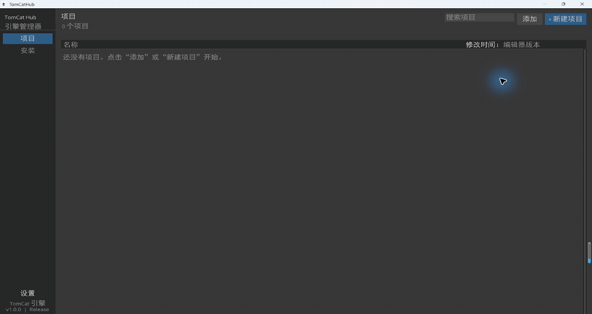
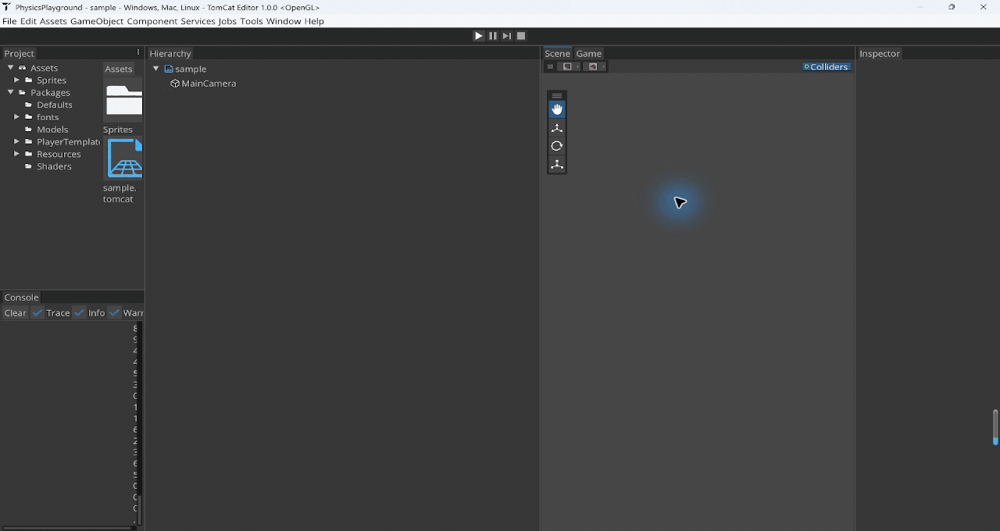
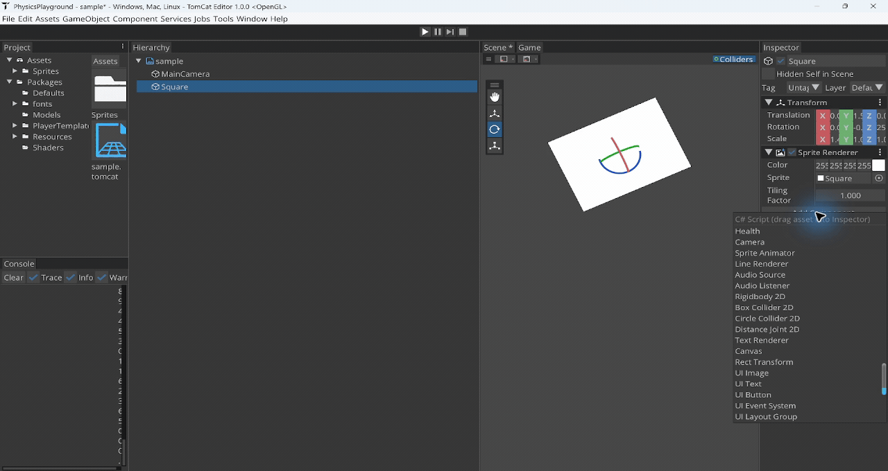
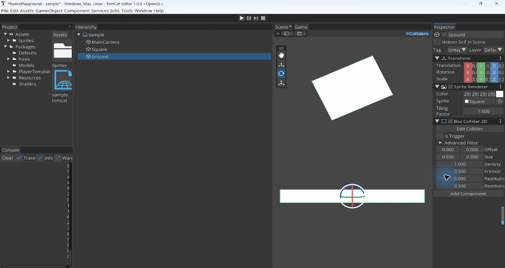

# TomCat Engine

一款面向 **2D 游戏开发的 C++20 开源引擎**，包含可视化编辑器、项目中心与独立游戏运行时。

TomCat 将场景搭建、资源管理、C# 游戏逻辑和 Box2D 物理集成在同一个开发环境中。
引擎库提供渲染、ECS 场景模型与运行时系统，Editor 提供对应的可视化编辑工具，
Player 则负责脱离编辑器运行打包后的游戏。

**C++20 · OpenGL · ImGui · Box2D · .NET 10 · Windows x64 · MIT**

**语言**：[English](README.md) | 简体中文

文档于 **2026-09-18** 按仓库源码核对，当前产品版本为 **0.2.0**。
全部指南及中文入口见[文档索引](docs/README.md)。

---

## 项目组成

| 模块 | 职责 |
| --- | --- |
| **Engine 引擎库** | 提供渲染、ECS 场景、资源、物理、输入、音频与 UI 系统的 C++ 库 |
| **Editor 编辑器** | 可视化搭建场景、编辑组件、浏览资源与运行预览 |
| **Hub 项目中心** | 管理项目模板、项目列表与 Editor 版本 |
| **Managed 脚本层** | 提供 C# 游戏开发 API、脚本编译与运行时托管 |
| **Player 游戏运行时** | 加载打包资源，使用随包附带的 .NET Runtime 独立运行游戏 |
| **Web 实验目标** | 基于 Emscripten/WebGL2 的 Player 与复用原生 ImGui 面板的编辑器，由浏览器宿主负责持久化 |

## 功能展示

### 项目管理与编辑工作区

Hub 根据编译进程序的产品身份发现 Editor，按实际可执行文件路径启动所选版本，不依赖目录名或程序文件名。Editor 将 Scene、Game、Hierarchy、Inspector、
Project 和 Console 面板组织在响应式停靠工作区中，并在面板开关或布局变化时主动保存。



### 可视化 2D 场景编辑

场景对象通过组件组合功能。内置 Sprite 图元、层级管理、仅影响 Scene 视图的可见性控制与
Transform 编辑支持快速搭建场景，并直接调整对象的位置、旋转和缩放。



### 组件化物理系统

Rigidbody2D 与碰撞体组件将场景对象接入 Box2D。Inspector 提供刚体类型和碰撞属性编辑，
Scene 视图显示碰撞轮廓，让物理边界与画面内容一起参与场景设计。



### 实时运行与调试

Play Mode 以固定时间步运行物理场景。合并后的 Play/Stop 按钮配合 Pause 和单帧 Step，
可用于观察运行状态，并在停止后恢复编辑场景。



示例项目 [PhysicsPlayground](Samples/PhysicsPlayground/README.md) 包含一个动态矩形与静态地板，
可用于体验基础 2D 物理交互。另见 [Editor 全屏截图](docs/portfolio/editor-fullscreen.png)。

## 特性

- **2D 渲染**：OpenGL 批渲染 Sprite、线条和圆形，支持相机、基于 Framebuffer 的 Scene/Game 视图、实体拾取、带 Rect/Pivot/PPU/Border 语义的稳定 Sprite Atlas 子资源、确定性 Sprite 排序、动画 Clip 与参数驱动的 Animator 状态机
- **场景系统**：ECS 实体、父子层级、稳定 UUID、严格 YAML 场景序列化、有序 Build Settings、异步读取/激活控制、共享运行世界的叠加场景、持久根对象与显式卸载
- **资产身份工作流**：稳定 `AssetHandle` 引用、`.tcmeta` schema-v2 Sidecar、ImporterRegistry、SHA-256 ArtifactKey、派生数据缓存、依赖跟踪，以及支持去抖内容监控、反向依赖重导和主线程发布的后台 ImportCoordinator
- **2D 物理**：固定 60 Hz Box2D 运行时、显式/隐式静态刚体、Box/Circle 碰撞体、Trigger、过滤、Raycast/AABB 查询、力、冲量和 `DistanceJoint2D`
- **物理编辑体验**：Scene 视图碰撞轮廓、碰撞体句柄、项目 Tag/Layer 与 Physics 2D 碰撞矩阵、合并的 Play/Stop 按钮与 Pause/Step 控制，以及延迟派发的 C# Collision/Trigger 回调
- **C# 脚本**：.NET 10 项目编译、Inspector 序列化字段、可回收 Play Domain、完整生命周期、Entity/Transform/Input/Physics/Scene API、诊断、last-good 程序集与 Cooked 托管负载
- **Prefab**：LocalID 实体子树和引用重映射、编辑器关联更新、Override、Apply/Revert、嵌套和变体；运行时 C# `Instantiate` 保持快照语义，详见 [Prefab 工作流](docs/PREFAB_WORKFLOW.zh-CN.md)
- **输入**：Action Map、键盘/鼠标/手柄绑定、输入上下文与运行时重绑定
- **运行时文字与 UI**：TTF/OTF/TTC 字体、确定性按需字形图集、严格 UTF-8、显式主字体/CJK/Emoji 回退链与最终替代字形、世界空间文字，以及具备 DPI 感知布局、裁剪、射线目标、导航和逐次交互 Gameplay 输入消费的 Canvas/RectTransform/Image/Text/Button/EventSystem/LayoutGroup 组件
- **音频**：内存 WAV Clip、有界 PCM WAV 流式播放、2D 空间音频、AudioSource/AudioListener、Null 与 XAudio2 后端、设备丢失降级，以及 Master/Music/SFX Bus
- **编辑器**：ImGui 驱动的 Scene、Game、Hierarchy、Inspector、Project 和 Console 面板，支持响应式停靠、面板开关/布局主动持久化、Hierarchy 场景可见性、诊断计数/过滤/折叠、Undo/Redo、自动保存/恢复、项目锁与用户设置
- **独立 Player**：按 Handle 寻址且无作者路径的 `.tcpak` v7，包含逐条目 SHA-256（Player 兼容读取 v5/v6/v7）、与 Editor 分离的运行程序、版本化 PlayerSettings/BootManifest、固定 Hash 白名单 win-x64 Player Template 与私有 .NET Runtime
- **Hub 项目管理器**：项目创建与发现、基于产品身份扫描 Editor 安装、版本选择、按准确可执行文件路径启动和用户级最近项目状态
- **UI 控件与本地化**：新增滑条、滚动视图、单行 Unicode 输入框、层级主题和游戏语言表回退；支持 OS 输入法提交文字，完整组合态仍有边界，详见 [UI 控件](docs/RUNTIME_UI_PRODUCT.zh-CN.md)
- **性能分析**：可视化 CPU 时间线、异步 GPU 帧计时、绘制统计、进程内存和资源分配估算；提供 [Profiler 与 C# 断点流程](docs/DEBUGGING_AND_PROFILING.md)
- **回归测试**：统一 Release 入口覆盖托管 ABI/生命周期、物理、Sprite 资产、脚本编译、安全边界、Editor 恢复、音频、导入器、输入、SceneManager、Prefab、Cook 与隔离 Player 启动；另有独立 WASM 编辑器协议回归

## 当前范围

- 支持的开发平台：**Windows x64**
- 渲染后端：**OpenGL 4.6**
- 实验性浏览器目标需要 **WebGL2 + SharedArrayBuffer/Workers**，详见 [Web 构建与限制](Web/README.zh-CN.md)。该目标不支持 C# 负载、可听音频、自定义 Cooked SPIR-V Shader 和多重采样 Framebuffer。
- 当前引擎主范围：**2D**
- 实验性 3D 模板仅配置透视相机，尚未实现生产级 3D 渲染器
- Editor 编译项目 C# 脚本需要安装 **.NET 10 SDK**
- 导出的 Player 携带固定私有 .NET Runtime 和所需 C++ 运行库，不依赖用户电脑的全局 .NET 环境或 Visual Studio
- 不支持 NuGet/第三方托管 DLL、Play Mode 热重载或内置 C# 调试器；异步场景的资源发布与激活仍在主线程，输入框尚无引擎内 IME 预编辑和候选窗定位

[2026-09-15 实机录制](docs/portfolio/README.md)曾遇到 Hub 使用 Windows 扩展路径加载项目时触发迁移检查错误，
当时通过 Editor 的 **File → Open Project** 和普通 Windows 路径打开。
这是历史录制观察，不代表已验证当前构建仍存在该问题。

## 构建

### 依赖

- Windows x64，并具备支持 OpenGL 4.6 的显卡与驱动
- Visual Studio 2022+
- .NET 10 SDK（Editor 编译项目 C# 脚本必需）
- Python 3 与 `pip`（供 Setup 辅助脚本使用）
- premake5（Setup 脚本自动下载）

> Vulkan SDK 通过 git 子模块自动提供（vendor/VulkanSDK，基于 VulkanSDK-Windows），无需手动安装或设置环境变量。

### 步骤

1. 克隆仓库（含子模块：git clone --recurse-submodules ...）
2. 首次运行前执行 `Scripts\Setup.bat`，准备 Premake 与 Setup 依赖
3. 运行 Scripts\Win_GenProjects.bat 生成 VS 工程
4. 根据需要打开 `Editor\Editor.sln`、`Builder\Builder.sln`、`Player\Player.sln` 或 `Tests\Tests.sln`，并以 Release x64 编译目标

CLI 工程需要单独生成，见 [TomCatCLI 中文指南](Tools/TomCatCLI/README.zh-CN.md)。
Web 使用独立的 [CMake/Emscripten 构建流程](Web/README.zh-CN.md)。

由 `Scripts\Setup.bat` 准备 Premake 后，运行 `powershell -ExecutionPolicy Bypass -File Scripts\Run-Regressions.ps1` 可执行完整 Release 回归套件。

## 目录结构

```
TomCat/            引擎核心库（渲染、ECS、物理、ImGui 集成）
Editor/TomCatInut/ Editor 应用
Player/            独立 Windows x64 游戏运行时
Managed/           .NET 10 运行时 API、源码生成器、Host 与回归
Builder/Manager/   Hub（项目中心）
Tests/             引擎回归测试工程
Scripts/           构建与打包脚本
Tools/TomCatCLI/    无界面 Cook 与 Windows Player 构建命令
Web/               实验性浏览器目标、字体与 WASM 协议回归
Samples/           可复现示例项目
docs/              文档索引与实机演示素材
vendor/            premake 与第三方依赖
```

## Editor 与 Hub 打包

- 本地打包：Scripts\Package-Editor.ps1 / Scripts\Package-Hub.ps1
- Push 与 Pull Request 会自动运行统一 Release 回归；打包 Workflow 仍可选择发布 Editor / Hub / 两者
- 官方 Editor 下载物是经 EVB 压缩的单个 `TomCat.exe`。Editor 资源保留在虚拟 `Packages` 树中；内嵌清单、Managed 工具链、无界面 CLI 和 win-x64 Player Template 只在 Editor 运行时需要时释放，并在校验后原子缓存到 `%LOCALAPPDATA%\TomCat\Editor\Runtime` 供后续复用
- 打包后的无界面构建通过 `TomCat.exe --cli cook ...` 或 `TomCat.exe --cli build ...` 调用；包装器校验同一份内嵌运行时，并返回缓存中 `TomCatCLI.exe` 的退出码
- UserSettings、布局、日志、项目源码与作者态 JSON 均位于可执行文件及不可变运行时缓存之外
- Editor 的 **Build** / **Build And Run** 会把已启用 Build Settings 场景 Cook 为 `Game.tcpak`，在 staging 中复制严格 Player Template，校验全部 SHA-256 与兼容版本后原子发布

## 当前状态与 Roadmap

### 已完成的 2D 物理里程碑

- [x] 固定步长 Play / Pause / Step / Stop 状态模型与合并的 Play/Stop 工具栏按钮（不设置独立 Simulate 状态）
- [x] 仅 Scene 视图显示 Box/Circle 碰撞轮廓，并支持 Edit Collider 句柄
- [x] CircleCollider2D、隐式静态刚体、Trigger、每 Fixture/项目 Layer 两级碰撞过滤、查询、运动 API 和 DistanceJoint2D
- [x] 延迟派发的引擎监听器/C# Collision 与 Trigger 回调
- [x] 项目级 Tag、16 个稳定 Layer 和对称 Physics 2D 碰撞矩阵设置
- [x] Scene writer v11、reader v9-v11、注册表组件持久化与 Cooked Package v7 物理往返
- [x] 物理回归测试套件（`Scripts\Run-PhysicsRegression.ps1`）

### 已完成的 C#、Player、Scene 与 Prefab V1

- [x] 托管运行时、源码生成器、Inspector 字段、last-good 编译、确定性生命周期/物理回调、异常隔离与可回收 Play Domain
- [x] 独立 win-x64 Player、私有 .NET Runtime、严格版本/Hash Player Template、Build / Build And Run 与 Player 子进程冒烟测试
- [x] 共享 `ProjectSettings/BuildSettings.json`、`.tcpak` v7 有序场景与 Player v5/v6/v7 读取、帧末安全点同步 SceneManager 切换及 C# SceneManager API
- [x] 使用稳定 LocalID 的快照 Prefab V1、Hierarchy/Joint/C# Entity 重映射、新 AttachmentID、延迟 C# 创建、Editor 创建/拖入操作与 Cook 依赖遍历
- [x] 版本化 `PlayerSettings.json` 提供产品/图标/显示/目录配置，嵌入 TCPAK v6 引入、v7 延续的 BootManifest
- [x] 关联/嵌套 Prefab、Override/Variant，异步读取、叠加场景、持久根对象和卸载（范围见各功能文档）
- [ ] 通用游戏存档系统

### 资产管线与 2D 内容生产

- [x] ImporterRegistry、SHA-256 ArtifactKey、派生数据缓存、`.tcmeta` schema v2 与依赖图
- [x] 后台 ImportCoordinator：内容 Hash 校验、去抖/合并、变更资产与传递反向依赖重导，以及主线程 Registry/资源发布
- [ ] 生产级真实格式转码、平台纹理压缩与 Mipmap 生成
- [x] 带列表式切片编辑器、Rect/Pivot/Pixels Per Unit/Border 元数据的稳定 Sprite Atlas 子资源，以及自包含的 Cook/Player 载荷
- [x] 确定性 Sprite 排序、动画 Clip，以及支持 Bool/Int/Float/Trigger 参数、AnyState 和 Exit Time 的 Animator 状态/过渡
- [x] TTF/OTF/TTC Font 导入、主字体/Fallback/Emoji 运行时字形链与世界空间 Text，以及支持 Anchor、Pivot、布局、裁剪、射线目标、DPI 缩放、鼠标/键盘/手柄控制和逐次交互 Gameplay 输入消费的 Canvas/RectTransform/Image/Text/Button/EventSystem/LayoutGroup UI
- [x] 自动透明区域/网格 Atlas Slicing、确定性 Atlas Packing、打包 TGA 导出与可视化 Animator Graph 编辑器
- [x] 稀疏 Tilemap2D 编辑、确定性固定步 ParticleSystem2D 模拟，以及作用于 Sprite、Tile 和粒子的全局/点状 2D 光照

### 引擎系统与工具链

- [x] Input Actions、键盘/鼠标/手柄绑定、输入上下文和重绑定
- [x] WAV 播放与有界 PCM WAV Streaming、2D 空间音频、设备丢失恢复、AudioSource/AudioListener、Null/XAudio2 后端与 Master/Music/SFX Bus
- [ ] OGG/Vorbis 解码（当前会明确拒绝不支持的输入，未捆绑解码器）

PCM WAV Streaming 在 Authoring 模式读取 Registry 解析出的源文件区间，因为 P0 Audio Importer 是逐字节透传；Cooked Player 则读取验证后的 TCPAK 区间。若未来 Authoring Importer 增加音频转码，必须改为暴露并读取验证后的 DDC Payload 区间，而不是源文件区间。

- [x] Undo/Redo、自动保存/恢复与项目锁
- [x] Editor Console：严重级别计数/过滤、重复日志折叠、Play 时清空与结构化脚本/运行时诊断
- [ ] Editor Profiler
- [x] 在 Push/PR CI 中运行托管、原生与 Player Release 回归
- [x] 组件注册/反射、Opaque Missing Component 保留与 SCB/ComponentApiV1 Bridge
- [x] 项目迁移预览、明确确认、事务升级和 Editor 中的中断迁移恢复；CLI 升级要求传入 `--migrate`
- [ ] 通用 Scene Schema 迁移工具与插件/模块 SDK
- [ ] Windows/OpenGL 的 2D 流程成熟后，再增加其他平台与渲染后端

### 未来 3D 范围

- [ ] Mesh/模型导入、Material、Light、PBR、阴影、环境渲染和骨骼动画
- [ ] 等 3D Runtime 与编辑流程成立后，再将当前仅有相机的 3D 模板转为正式功能

## 相关项目

- [Ekit](https://github.com/chnnasn/ekit)：自研、面向调用者友好的 header-only ECS 库
- [VulkanSDK-Windows](https://github.com/chnnasn/VulkanSDK-Windows)：预编译 Vulkan SDK 子集（子模块集成，免环境变量）

## 许可证

[MIT](LICENSE) © 2026 chnnasn
