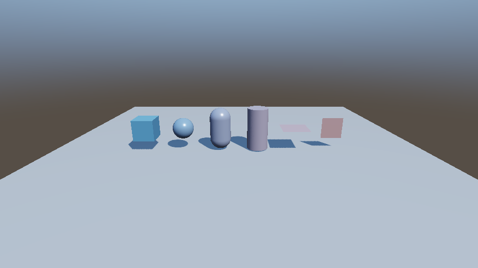

# 六种 3D 图元

用 Hub 打开 `Project.tcproj`，再打开 `Assets/Scene/sample.tomcat`。Game 视图从左到右依次为 Cube、Sphere、Capsule、Cylinder、Plane、Quad。所有图元使用内置网格与 PBR，无外部资产依赖。

Hierarchy 右键 → **3D Object** 可创建这六种形状；也可在 Mesh Renderer 的 Primitive 下拉框中切换。Transform 控制位置、旋转和尺寸。

- Cube：边长 1。
- Sphere：直径 1。
- Capsule：Y 轴方向，总高 2、直径 1。
- Cylinder：Y 轴方向，高 2、直径 1，包含上下端盖。
- Plane：水平 XZ 平面，朝 +Y，默认 10×10，10×10 网格。
- Quad：竖直 XY 平面，朝 +Z，默认 1×1，两个三角形。

演示中的 Plane 已缩小到 1.3×1.3，Quad 转向相机，便于比较。旧场景中 Primitive=2 的竖直 Plane 仍保持原来的几何与朝向，现在显示为 Quad。

