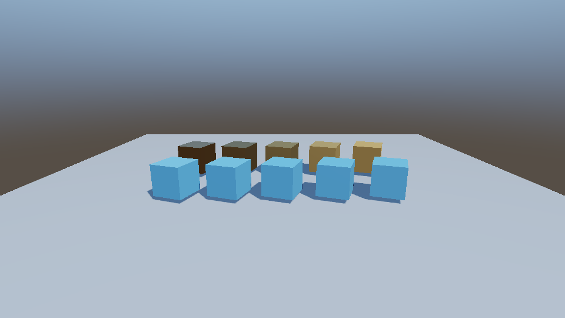

# OpenGL 3D 分支

`dev_opengl3D` 已整合 `main` 的 `4f507c7`，并把原有静态 3D 渲染接入当前组件、资产和运行时系统。

## 使用

1. 在 Scene 工具栏关闭 2D 模式。
2. Hierarchy 右键 → **3D Object → Cube / Plane**，或把 Project 中的 OBJ、FBX、glTF、GLB 资源拖进 Scene。
3. Inspector 的 **Mesh Renderer** 支持启用状态、颜色、Mesh、Albedo、UseTexture，以及 Metallic、Roughness、AmbientOcclusion、自发光和投射/接收阴影。Primitive 值为 0=None、1=Cube、2=Plane；指定 Mesh 时优先显示该资产。
4. Game 使用场景中的主相机。使用 Perspective 投影，相机本地 **+Z** 指向物体，与 main 的相机约定一致。

模型的节点变换会烘焙到静态顶点；多子网格、漫反射颜色及编码的漫反射贴图保存在模型 Artifact 中，Player 从打包数据加载，不依赖开发机模型路径。glTF 的外置 buffer、OBJ 的 MTL 与贴图等文件应随模型一起放入 Assets。外部文件内容参与缓存键和导入完成时的变更检查；资源监视会保守地重新检查模型缓存。

## 与 main 的整合

- Scene/Game 共用 3D 绘制，沿用层级世界变换、运行时插值、激活状态与编辑器隐藏状态。
- Mesh Renderer 注册到 ComponentRegistry，支持场景保存、Play 副本、复制、Prefab、属性编辑与 Undo/Redo 所使用的场景快照。
- Mesh、Albedo 与环境 Panorama 使用稳定 AssetHandle；场景和 Prefab 的 Cook 依赖遍历会收集这些引用。
- C# 可使用 `entity.GetComponent<MeshRenderer>()`、`entity.GetComponent<Light3D>()`、`entity.GetComponent<Environment3D>()` 访问对应 Inspector 参数；Transform、生命周期、输入和场景 API 沿用 main。
- 运行时 UI、音频和场景加载流程保留；3D Draw 调用进入 main 的 FrameProfiler。
- 2D/3D UniformBuffer 上传时重新绑定相应槽位；拾取 ID 使用整数传递。

## 天空、灯光、阴影与 PBR

可直接用 Hub 打开 `Samples/PBRLighting/Project.tcproj`，再打开 `Assets/Scene/sample.tomcat`。前排为非金属，后排为金属；每排从左到右粗糙度递增。该场景不需要外部素材。



- **天空**：Hierarchy → 3D Object → Sky / Environment。默认生成天空与地面渐变；将等距柱状全景图拖到 Panorama 可替换背景。Rotation 绕世界 Y 轴旋转全景，ShowSky 只隐藏背景，仍保留环境照明。Intensity 同时调整背景和照明，AmbientIntensity 只调整物体环境照明，Exposure 调整 3D 输出曝光。
- **HDR**：`.hdr` 导入保留线性浮点亮度，生成浮点 mip，Cook 写入包内；GPU 使用 RGBA16F。PNG/JPG 按资产导入的 sRGB 设置采样。这里支持一张全景图，不是六张独立 cubemap 面。
- **可编辑灯光**：Hierarchy → 3D Object → Directional / Point / Spot Light。方向光和聚光灯沿实体本地 **+Z**，可使用 Transform 旋转。点光/聚光灯使用平方反比衰减与 Range 截断；聚光灯的内外半角以度为单位，内部会把内角限制到外角以内。
- **阴影**：每帧选择首个可投影的方向光，使用 2048² 深度图和 3×3 PCF。ShadowExtent 是以相机为中心的阴影覆盖半径；调小可提高近景精度，调大可覆盖远处物体。ShadowBias 控制自阴影偏移。Mesh Renderer 可分别开关 CastShadows / ReceiveShadows。
- **材质**：Cook–Torrance GGX + Smith + Schlick 的金属度/粗糙度模型，支持 Albedo、Metallic、Roughness、AO、自发光。环境漫反射使用余弦采样，环境镜面反射使用 GGX 重要性采样；随后进行 ACES 曲线与显示 gamma。当前每个片元各取 32 个漫反射/镜面样本，亮点很集中的全景图可能出现采样误差，复杂场景后续可改成预过滤探针以降低开销。

灯光按实体 UUID 排序，最多取 16 盏；多个启用的 Environment 取最小 UUID。没有 Light3D 组件的旧场景使用默认方向光；有组件但全部禁用时不会重新补光。Mesh v1 自动迁移为 v2：非金属、粗糙度 0.5、AO 1、无自发光、开启阴影。

范围：阴影目前仅支持一盏方向光，点光/聚光灯不投影；没有级联阴影、屏幕空间反射、透明材质排序、法线/金属粗糙度贴图、独立材质资产或模型 PBR 参数自动导入。模型仍沿用已有的漫反射纹理与颜色，再应用实体上的 PBR 参数。Box2D、2D Light、Tilemap 和 Sprite Animator 保持各自的 2D 语义，没有新增 3D 刚体或骨骼动画。Web 的着色器转换同步适配了新接口，本次实际验收为 Windows OpenGL 4.6。


## 构建和验证

先执行 `git submodule update --init --recursive`。本机需要 VS 2022 C++ 工具链、CMake、.NET 10；TomCat 的 prebuild 会构建 Assimp，原生应用的 postbuild 会复制其 DLL，Player 模板和 Editor 打包流程也包含该依赖。

```powershell
Scripts/Run-Regressions.ps1 -Configuration Release
Tests/bin/Release-windows-x86_64/Renderer3DRegression/Renderer3DRegression.exe --gpu
```

默认 3D 回归不创建图形窗口，检查场景、Play 副本、Prefab、Cook 引用、属性约束、glTF 节点与材质 Artifact。`--gpu` 额外创建隐藏的 OpenGL 4.6 窗口，检查实体拾取、禁用组件、2D/3D 相机缓冲切换，以及灯光方向/锥角、阴影明暗差异、接收阴影开关、PBR 参数、天空拾取、HDR 采样和 GL 状态恢复。无窗口部分另检查旧 Mesh 迁移、新组件持久化、HDR 亮度与打包依赖。
